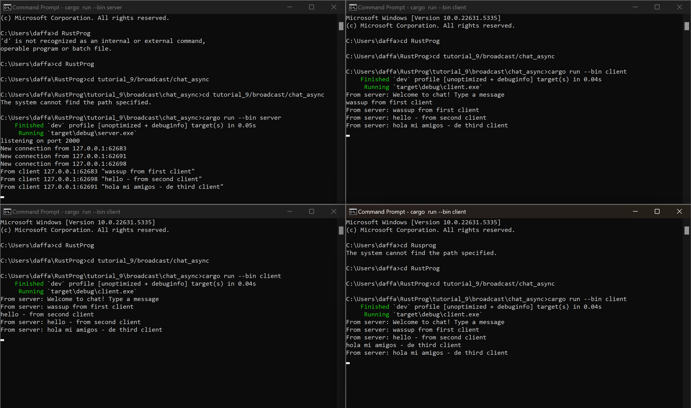
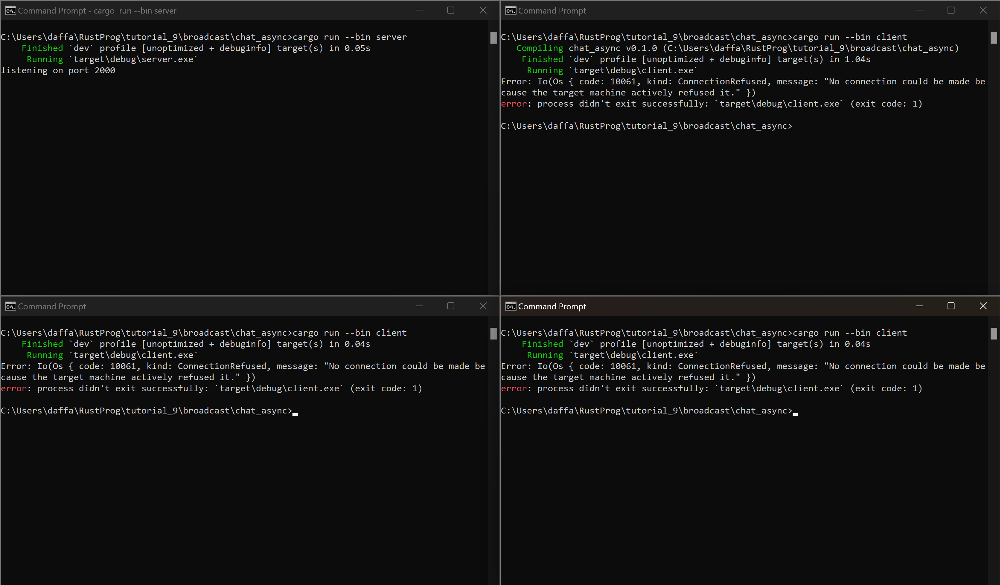
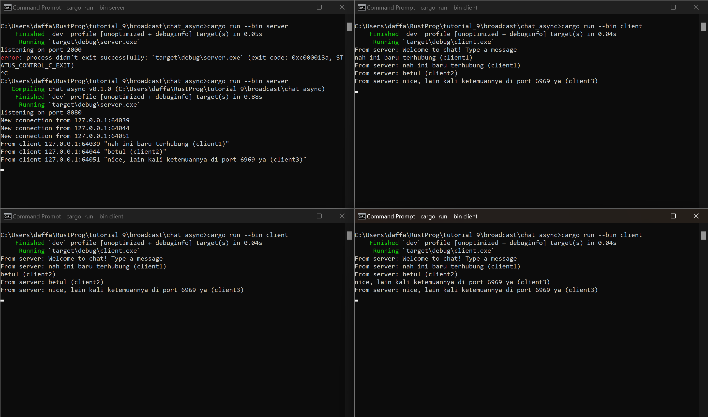
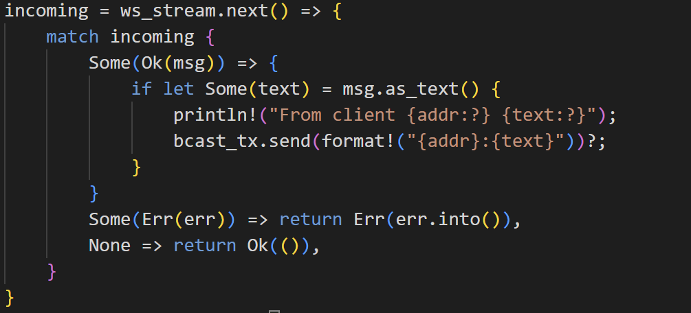
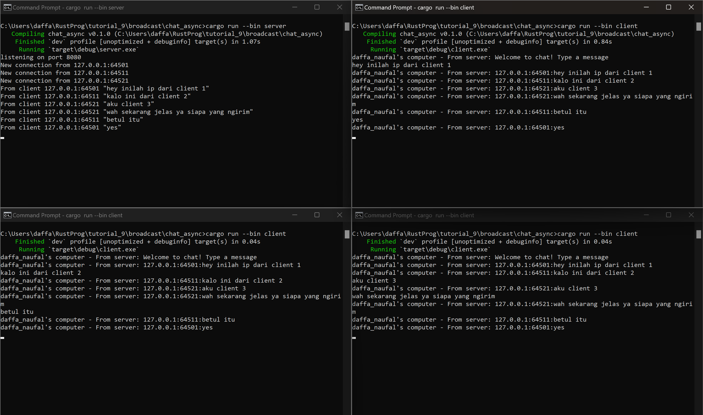

__2.1. Original code of broadcast chat__

- Untuk run server: `cargo run --bin server`
- Untuk run client: `cargo run --bin client`

Dari output yang terlihat, awal mula setiap client yang dijalankan akan terhubung ke server lalu ketika kita memberikan pesan dari satu client maka setiap klien dan server akan menerima pesan siaran dari klien pertama yang memberikan tersebut. 

Setiap kali seorang klien memasukkan pesan melalui baris perintah, pesan tersebut akan dikirimkan ke server dan kemudian server akan meneruskannya ke semua klien yang terhubung.

__2.2: Modifying port__

Gambar diatas adalah gambar dari server dan client yang tidak memiliki port yang sama (server 2000, client 8080). Hal ini menyebabkan tidak dapatnya terhubung client ke server. Port tempat server 'listen' itu di port 2000, sedangkan client malah berusaha menyambungkan diri ke port 8080 yang tidak ada siapa-siapa (server) disitu.

Gambar diatas adalah kondisi ketika client dan server sudah berada di port yang sama yaitu 8080, dengan port yang sama ini menunjukkan bahwa client dan server dapat terkoneksi. Ini menunjukkan bahwa jika client diubah portnya maka server juga harus diubah karena ini adalah komunikasi 2 arah antar server dan client. Ibaratnya mereka harus bertemu di tempat (port) yang sama agar dapat terjadi hubungan.

__2.3 : Small changes, add IP and Port__

Dengan edit kode berikut, diharapkan ketika satu client mengirimkan pesan ke server dan server mengirimkan ke semua clientnya akan dikirim juga IP dan port dari client yang mengirimkan pesan dengan variabel `addr` yang sudah dipersiapkan dalam `bcast_tx` sebgai tempat pesan yang digunakan. Jadi ketika server menerima pesan dari client, ia akan mengeprint ip client dan message nya ke server itu sendiri, lalu `bcast_tx,send()` akan mengirim pesan ke semua client berdasarkan format yang ada, yaitu ada ip client pengirim dan pesannya.

Berikut hasilnya

